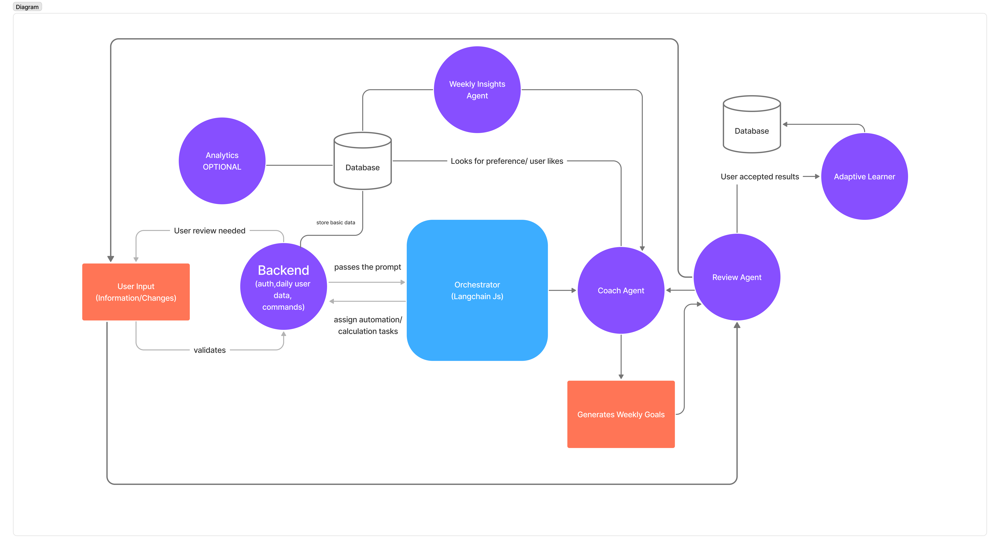

🧠 Problem We’re Solving

Most students and young professionals who go to the gym regularly struggle to eat right without overspending. 💸🥦

You either:

Spend too much on “healthy” foods 🍗

Or save money but fall short on nutrition ⚖️

And still end up spending hours planning, calculating, and adjusting every week 📊⏳

There are plenty of apps that track calories or budgets — but almost none that connect both worlds in a smart and personal way.
That’s where our system steps in. 🚀

🤖 What We’re Building

We’re creating an agent-based fitness and nutrition planner that helps users reach their health goals within their own weekly budget — no financial data required.

Here’s how it works:

👤 Enter your details — height, weight, age, and fitness goal.
The system automatically calculates your BMI, calories, and protein targets.

💰 Set your weekly food budget (and optional gym cost).
This becomes your “fitness budget” for the week.

🥗 Choose your dietary preferences — halal, vegetarian, or specific food exclusions.

📅 (Optional) Log what you ate and spent last week.
The system analyses your intake and spending to see if you’re on track.

🏃‍♀️ Add your physical activities — like gym sessions, running, or swimming.
The system updates your calorie requirements based on your routine.

🍽️ Get your 7-day meal plan built from a curated recipe library.
You can add your own recipes, and every meal includes macros and cost estimates.

🧮 See your full breakdown — total calories, protein, and cost vs. budget.
The system suggests cheaper or higher-protein swaps if needed.

All of this is powered by a group of intelligent agents working together —
each handling a specific part like nutrition, costing, optimisation, and coordination. ⚙️🤝

🎯 Who It’s For

🧑‍🎓 Students and early-career professionals balancing fitness and finances.
💪 Anyone who wants high-protein, affordable meal plans tailored to their goals.
🕒 People who value automation and want to save time without sacrificing health.

🧩 System Architecture

Our system combines a React + TypeScript frontend, a Node.js (TypeScript) backend, and an agent-orchestrated planning layer built with LangChain JS. Together, they generate personalised, cost-aware fitness meal plans that adapt to user preferences and budgets.

User → Frontend → Backend → Coach ↔ Review Agents → Adaptive Learner → Database

🖥️ Frontend

    Built with React + TypeScript + Tailwind + shadcn/ui

    Collects user information (height, weight, goal, diet preferences, activity, weekly budget)

    Displays structured weekly plans (Morning → Pre-workout → Post-workout → Snacks → Dinner)

    Allows users to edit meals and instantly view updated calories, macros, and cost

⚙️ Backend (API)

    Powered by Node.js + TypeScript (NestJS or Express)

    Handles all deterministic logic, including:

        BMI / TDEE / macro calculations

        Cost estimation + budget validation

        Recipe and plan storage

        Authentication (JWT / NextAuth)

    Uses PostgreSQL + Prisma for persistent data and Redis for async queues

🤖 Agents (LangChain JS)

    Coach Agent → Builds and explains the initial weekly plan based on user data, preferences, and budget

    Review Agent → Responds to user edits (“remove banana”, “add beef”), recalculates via backend, and sends the result back to the Coach

    Prior-Week Narrator → Optional LLM that summarises last week’s progress and spending

    Adaptive Learner → Non-LLM service that updates recipe costs, preferences, and macro tolerances over time

🔁 Coach ↔ Review Loop

1️⃣ Coach Agent drafts the weekly plan
2️⃣ User reviews and requests changes
3️⃣ Review Agent applies edits, recalculates macros + costs, and suggests compensations
4️⃣ Coach Agent re-optimises the plan using the new context
5️⃣ Repeat until the user accepts ✅
💾 Data & Storage

    PostgreSQL → Users, recipes, plans, budgets, learning parameters

    Redis → Job queue / ephemeral memory for the orchestrator

    S3 / MinIO (optional) → Plan exports (CSV / PDF)

📊 Analytics (optional)

Attach Superset / Metabase later for insights such as:

    Budget vs actual spend (%)

    Macro accuracy (Protein / Kcal)

    Plan acceptance rate (%)

    Common swaps or dislikes</selection>” selected.

Flow Chart :

## 🧾 Figma Workflow



## 🧑‍💻 Local Development Setup

1. **Install dependencies**
   ```bash
   npm install
   ```
2. **Environment variables**  
   Copy `.env.example` to `.env` and adjust ports, database URL, and Ollama model names if needed.
3. **Database (Dockerised Postgres)**  
   ```bash
   docker compose up -d postgres
   # tables auto-sync when the backend boots
   npm run db:seed --workspace backend   # optional sample data
   ```
4. **Ollama runtime**  
   Install Ollama locally, pull a chat-capable model (e.g. `ollama pull llama3:latest`) and keep the daemon running. Update `OLLAMA_MODEL` in your `.env` if you switch models.

## 🚀 Running the services

| Service   | Command | Notes |
|-----------|---------|-------|
| Backend API (Express + pg) | `npm run dev:backend` | Serves `/api/*` routes, handles auth/calculations/storage |
| Agent Orchestrator (LangChain + Ollama) | `npm run dev:agents` | Exposes `/plan/generate`, wraps prompts + LLM calls |
| Frontend (React + Vite + shadcn/ui) | `npm run dev:frontend` | Vite dev server with proxy-free API calls |

## 📁 Project structure

```
ai-agent/
├── backend/        # Node API, Prisma models, meal logic
├── agents/         # LangChain orchestrator talking to Ollama
├── frontend/       # React + Tailwind + shadcn UI
├── docs/           # Diagrams (flow/sequencing/figma exports)
├── docker-compose.yml
├── tsconfig.base.json
└── README.md
```

## 🧪 Validation scripts

- `npm run lint --workspace backend`
- `npm run lint --workspace agents`
- `npm run build --workspace frontend`
- API smoke test: `curl http://localhost:4000/health`
- Agent smoke test: `curl http://localhost:4001/health`

Goal:
1. Document the implementation roadmap inside this README and keep architecture assets updated.
2. Scaffold the monorepo (shared tooling, Dockerized Postgres, env templates) before coding features.
3. Build the Node/TypeScript backend with Prisma models, meal-planning logic, and APIs that talk to LangChain agents.
4. Ship the LangChain + Ollama agent service that handles plan drafting/review loops and exposes HTTP hooks.
5. Deliver the React + TypeScript frontend (shadcn UI) covering onboarding, plan review, and edit workflows.
6. Finish with testing scripts plus developer ops docs so the whole system runs locally end-to-end.
